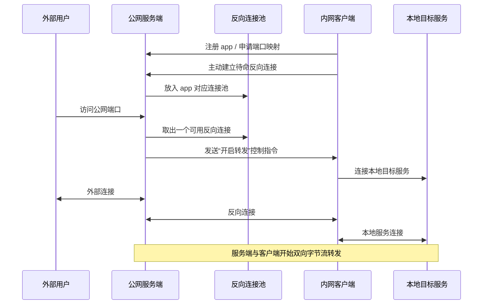

# NSmartProxy 内网穿透原理与优化评审

本文档用于重新梳理 `NSmartProxy` 的实现原理、核心链路、适用边界，以及当前仍然值得继续优化的点。

## 1. 结论摘要

`NSmartProxy` 的整体思路是成立的，而且属于很经典的一类方案：它不是 `STUN/TURN`，也不是 P2P 打洞，而是一个 **反向连接池 + 服务端统一转发** 的内网穿透模型。

一句话概括：

- 内网客户端主动连接公网服务端，并维持待命的反向连接
- 外部用户访问公网端口时，服务端从待命连接池中取出一个可用反向连接
- 服务端通知客户端去连接本地真实服务
- 随后两边开始双向转发字节流
- 当前连接结束后，隧道关闭并回收

最终结论如下：

- 作为内网穿透工具，`NSmartProxy` 是可用的
- 作为“反向 TCP 隧道”，它很适合继续用
- 作为长期高并发、强运维、强扩展的平台，它还需要一轮架构级优化
- 当前最值得继续优化的重点，不是零散微优化，而是反向连接池、协议收敛、监控指标和 HTTP 能力边界

## 2. 架构图

### 2.1 整体架构图


### 2.2 连接建立与转发流程图



### 2.3 纯文本链路图

```text
外部用户
   |
   v
公网服务器监听端口
   |
   | 1. 查找此端口对应的 app
   | 2. 从 app 的反向连接池取出一条待命连接
   v
服务端发送控制指令
   |
   v
内网客户端收到指令
   |
   | 3. 去连接本地真实服务
   v
本地服务

随后进入双向转发：
外部用户 <-> 服务端 <-> 客户端 <-> 本地服务
```

## 3. 它到底是什么方案

### 3.1 不是打洞，而是反向隧道

`NSmartProxy` 的本质是“客户端主动出站，服务端统一接入”。

公网服务端负责：

- 接收客户端配置请求
- 接收客户端建立的反向连接
- 监听对外暴露的消费端口
- 有外部请求时，把请求绑定到一个可用反向连接

内网客户端负责：

- 主动登录服务端，注册要暴露的 app
- 主动建立可复用的反向连接
- 收到服务端指令后，去连接本地目标服务
- 把服务端过来的数据与本地服务的数据进行双向搬运

这类模型的核心特点是：

- 不依赖 NAT 打洞成功率
- 对客户端网络要求低，只要能主动出站即可
- 服务端天然成为统一入口

## 4. 代码主链路

### 4.1 服务端启动

服务端启动入口在 [Server.cs](</D:/Work/QuestionByAi/NSmartProxy/src/NSmartProxy/Server.cs:96>)。

启动后会完成这些职责：

- 初始化数据库与上下文
- 启动反向连接监听
- 启动对外消费端口监听
- 启动配置和管理相关服务
- 启动心跳检查与证书初始化

也就是说，服务端同时承担了：

- 控制面
- 数据面
- 端口映射与 app 生命周期管理

### 4.2 客户端先申请配置

客户端的配置申请入口在 [ServerConnectionManager.cs](</D:/Work/QuestionByAi/NSmartProxy/src/NSmartProxy.ClientRouter/ServerConnectionManager.cs:91>)。

它会向服务端发送：

- 客户端标识
- app 数量
- 每个 app 的协议类型
- 希望暴露的端口
- 是否压缩
- Host 和描述信息

服务端在 [ClientConnectionManager.cs](</D:/Work/QuestionByAi/NSmartProxy/src/NSmartProxy/ClientConnectionManager.cs:193>) 中完成：

- `clientId` 分配
- `appId` 分配
- 对外消费端口安排
- 端口与 app 的映射注册

### 4.3 客户端建立反向连接池

配置完成后，客户端会为每个 app 主动连接服务端，入口在：

- [ServerConnectionManager.cs](</D:/Work/QuestionByAi/NSmartProxy/src/NSmartProxy.ClientRouter/ServerConnectionManager.cs:220>)
- [ServerConnectionManager.cs](</D:/Work/QuestionByAi/NSmartProxy/src/NSmartProxy.ClientRouter/ServerConnectionManager.cs:237>)

这些连接不是立刻承载业务流量，而是先作为“待命反向连接”存在。

服务端在 [ClientConnectionManager.cs](</D:/Work/QuestionByAi/NSmartProxy/src/NSmartProxy/ClientConnectionManager.cs:78>) 接收后，会把这些连接放入 app 对应的连接池。

单个 app 的反向连接池定义在 [NSPApp.cs](</D:/Work/QuestionByAi/NSmartProxy/src/NSmartProxy/NSPApp.cs:25>)，而取出一个可用连接的逻辑在 [NSPApp.cs](</D:/Work/QuestionByAi/NSmartProxy/src/NSmartProxy/NSPApp.cs:59>)。

### 4.4 外部用户访问公网端口

当外部用户访问服务端暴露的端口时，服务端进入消费连接处理逻辑，入口在 [Server.cs](</D:/Work/QuestionByAi/NSmartProxy/src/NSmartProxy/Server.cs:414>)。

处理路径分两类：

- 普通 `TCP` 模式：按端口直接匹配 app
- `HTTP + Host` 模式：先解析请求头里的 `Host`，再做路由

`HTTP + Host` 的解析逻辑在 [Server.cs](</D:/Work/QuestionByAi/NSmartProxy/src/NSmartProxy/Server.cs:989>)。

拿到目标 app 之后，服务端会调用 [ClientConnectionManager.cs](</D:/Work/QuestionByAi/NSmartProxy/src/NSmartProxy/ClientConnectionManager.cs:152>)，从反向连接池中取出一个可用连接。

### 4.5 服务端通知客户端建立本地回源连接

服务端侧 TCP 转发主逻辑在 [Server.cs](</D:/Work/QuestionByAi/NSmartProxy/src/NSmartProxy/Server.cs:850>)。

客户端收到控制指令后的入口在 [Router.cs](</D:/Work/QuestionByAi/NSmartProxy/src/NSmartProxy.ClientRouter/Router.cs:411>)。

之后客户端会进入真正的 TCP 转发逻辑：

- [Router.cs](</D:/Work/QuestionByAi/NSmartProxy/src/NSmartProxy.ClientRouter/Router.cs:625>)
- [Router.cs](</D:/Work/QuestionByAi/NSmartProxy/src/NSmartProxy.ClientRouter/Router.cs:662>)

这一步会发生两件事：

- 客户端去连接本地目标服务
- 客户端把服务端流量和本地服务流量做双向转发

## 5. 当前实现的优点

### 5.1 模型简单、稳定

这套方案最大的优点是结构直白：

- 服务端负责统一暴露
- 客户端负责主动出站和本地回源
- 数据流就是标准双向字节搬运

这通常比复杂打洞方案更容易维护。

### 5.2 很适合 TCP 透传

它天然适合：

- 本地 Web 服务
- 本地 API 服务
- `new-api` / OpenAI 兼容接口
- 管理面板

尤其在 `TCP` 模式下，它对上层协议几乎无感知，只要是稳定的 TCP 服务，一般都能挂上去。

### 5.3 服务端统一暴露资源

公网服务器统一对外暴露端口或域名，带来的实际价值包括：

- 客户端无需公网 IP
- 内网机器只要能主动出站就能接入
- TLS、域名、反向代理都可以集中放到公网服务器处理

## 6. 当前实现的主要问题

### 6.1 反向连接池策略太朴素

这是当前最值得优先优化的点。

从 [NSPApp.cs](</D:/Work/QuestionByAi/NSmartProxy/src/NSmartProxy/NSPApp.cs:25>) 的定义和注释看，单个 app 的待命反向连接往往非常少，很多时候接近“只有一条”。

这会带来几个问题：

- 短时并发一高，容易没有空闲反向连接
- 隧道建立等待时间会被放大
- 热点 app 没有自适应能力

这意味着它现在更像“单连接串行消费”，而不是“弹性反向连接池”。

### 6.2 协议实现分散

控制帧、长度头、关闭通知、保活逻辑分散在：

- `Server.cs`
- `Router.cs`
- `ServerConnectionManager.cs`
- `ClientConnectionManager.cs`

这会让后续问题变得明显：

- 代码理解成本高
- 协议升级容易漏改
- 压测和链路观测不够容易标准化

### 6.3 HTTP 能力不够专业

当前 `HTTP + Host` 模式本质上是自己读取请求头里的 `Host` 来分流，逻辑在 [Server.cs](</D:/Work/QuestionByAi/NSmartProxy/src/NSmartProxy/Server.cs:989>)。

它能工作，但不适合作为复杂 HTTP 网关的长期主力能力。

主要边界包括：

- 更适合 HTTP/1.x 简单场景
- 不适合承担复杂的 HTTPS/TLS 终止
- 不适合承载复杂路由、重写、缓存和头部策略

### 6.4 服务端状态集中，横向扩展一般

服务端把客户端、端口映射和 app 状态集中维护在上下文里，核心位置在：

- [NSPServerContext.cs](</D:/Work/QuestionByAi/NSmartProxy/src/NSmartProxy/Authorize/NSPServerContext.cs:19>)
- [NSPServerContext.cs](</D:/Work/QuestionByAi/NSmartProxy/src/NSmartProxy/Authorize/NSPServerContext.cs:77>)

对单机场景这没问题，但对以后要做：

- 多实例
- 负载均衡
- 故障切换
- 水平扩容

就不够友好。

### 6.5 可观测性不足

当前日志足够排查基本问题，但不够支撑性能治理。

比较缺的指标包括：

- 每个 app 的空闲反向连接数
- 连接池弹出超时次数
- 隧道建立耗时
- 活跃隧道数
- 压缩命中率和压缩比
- 每个端口或 Host 的活跃连接数

没有这些指标时，很难判断“慢”到底慢在哪一层。

## 7. 推荐的使用方式

如果把 `NSmartProxy` 用于大模型 API 或一般 Web/API 服务，我更推荐这样分层：

- `NSmartProxy` 只负责 `TCP` 内网穿透
- `Nginx` 或 `Caddy` 负责 `80/443`、TLS、域名和 Host 路由

架构可以理解为：

```text
外部用户
  -> Nginx / Caddy
  -> NSmartProxy 暴露的 TCP 端口
  -> 内网客户端
  -> 本地目标服务
```

这样做的好处是：

- `NSmartProxy` 不必承担复杂 HTTP 细节
- `SSE`、TLS、域名配置更容易稳定
- 以后迁移、排障和扩容都更清晰

## 8. 最值得继续优化的点

### 8.1 第一优先级：反向连接池

建议把每个 app 的待命反向连接数做成可配置能力，而不是默认只维持极少量连接。

推荐方向：

- 支持每个 app 自定义最小池大小
- 支持动态预热
- 热点 app 自动补充更多待命连接
- 加入池耗尽告警和统计

这一项对吞吐、并发和建隧道延迟的改善，通常比继续做零碎微优化更明显。

### 8.2 第二优先级：协议收敛

建议单独抽出协议编解码层。

推荐方向：

- 把控制帧格式集中到一个组件
- 统一长度头、命令码、错误码和关闭通知
- 减少客户端与服务端各自手拼字节的逻辑

### 8.3 第三优先级：补监控指标

建议至少补这些指标：

- app 级空闲反向连接数
- 隧道建立耗时
- 活跃隧道数
- 连接池超时次数
- 压缩命中率和压缩比
- 每个 app 的上下行字节量

### 8.4 第四优先级：明确 HTTP 边界

建议把职责边界定清楚：

- `NSmartProxy` 主做 TCP
- `HTTP + Host` 作为兼容功能保留
- 正式生产流量优先交给 `Nginx/Caddy`

这样后续演进时，不会把复杂 HTTP 网关能力继续堆进 `NSmartProxy` 本体。

## 9. 最终判断

我的最终判断如下：

- `NSmartProxy` 的内网穿透原理没有问题
- 它当前最适合做“反向 TCP 隧道”
- 对你现在的使用场景来说，它可以继续使用
- 如果要走长期稳定、高并发、易运维路线，下一步应该做连接池、协议层和监控层升级

如果只选一个最值得马上动手的改造项，我会选：

- **给每个 app 增加可配置的反向连接池大小**

这项改造最贴近它当前的真实瓶颈，也最容易转化成吞吐、延迟和并发体验上的改善。
